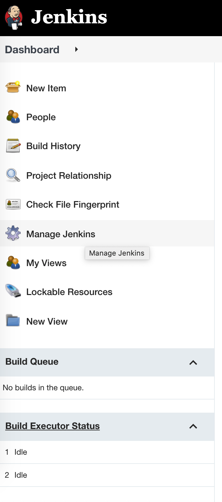
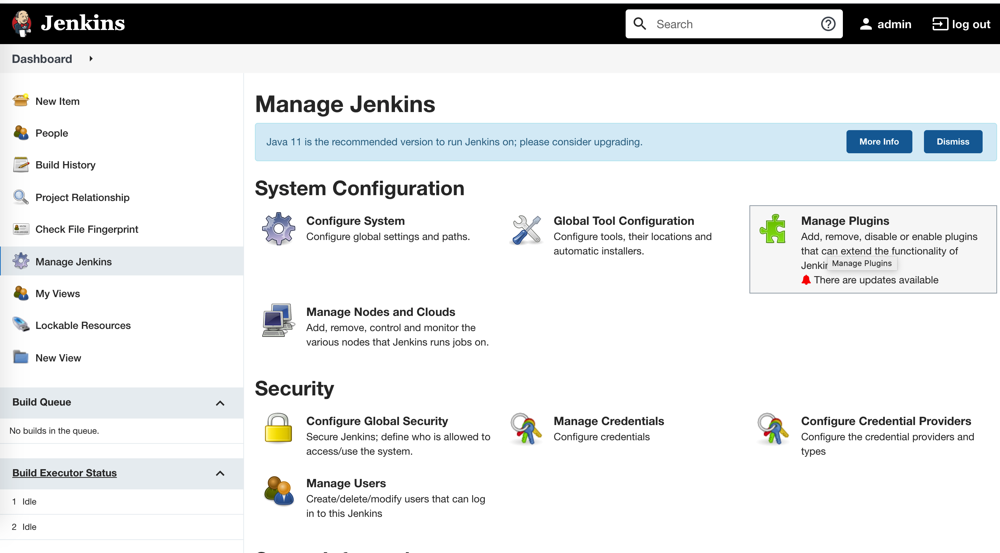

# DevOps
# Jenkins Setup
---------------------------------------

Step 1. Resource creation
    
 1. AWS **account** is required with permission to create role.
 
 2. **VPC** and **Subnet** - In which you want to create infrastructure to deploy the code.
    1. For simplicity and easy access of UI's please select **public subnet**. 
    2. VPC and Subnet must be configured, before running Jenkins pipeline, Create it if not already present.
 
 3. Create a EC2 Role - **RisingMinervaEC2JenkinsRole**
       - Instance type - Any (t2.nano)
       - IAM Role permission 
            - AmazonEC2FullAccess - (For creating Ec2 instance via terraform for our application to deploy)
            - AmazonEC2RoleforSSM - (Login via Session manager)
            - IAMFullAccess - (Creating or Assigning role to Ec2 )
            - AmazonS3FullAccess - (Uploading binary to s3)
            - AmazonSSMFullAccess - (Installing SSM on other Ec2)
            
 4. Attach a public ip to the Ec2 instance.
 
 5. Create and Security group with all inbound and outbound access and attach this to Ec2.
      - ALL TCP traffic from Anywhere
      - Recommendation - Use more restricted inbound access.
 6. Create stack using CloudFormation: [**RisingMinerva-Jenkins-EC2-CFT.yml**](https://github.com/Rising-Minerva/DevOps/blob/main/Jenkins_Installation/RisingMinerva-Jenkins-EC2-CFT.yml) 
---------------------------------------

Step 2. Below are the commands to manually install and configure Jenkins

1. Connect to the EC2 instance via SSH or via Session manager.
2. Update the yum package management tool.
     ```   
     $ sudo yum update –y
     ```
3. Download the latest Jenkins code package.
   ``` 
    $ sudo wget -O  /etc/yum.repos.d/jenkins.repo http://pkg.jenkins-ci.org/redhat/jenkins.repo 
    ```
4. Import a key file from Jenkins-CI to enable installation from the package.
    ```
       $ sudo rpm --import https://pkg.jenkins.io/redhat/jenkins.io.key
    ```
5. Install Jenkins.
     ```
      $ sudo yum install jenkins -y 
     ```
6. Start Jenkins as a service.
     ```      
       $ sudo service jenkins start
     ```
7. Check jenkins service is running 
      ```
    ps -ef | grep -i jenkins
    ```
---------------------------------------

Step 3. Common error 
1. daemonize error
     ```
    Error: Package: jenkins-2.303.1-1.1.noarch (jenkins)-Requires: daemonize
    
    Install and enable epel before download daemonize
    # sudo yum install epel-release -y 
    # sudo yum-config-manager --enable epel
    # sudo yum install daemonize -y  
     ```

2. JAVA Error 
    ```java
     sudo amazon-linux-extras install epel -y 
     sudo yum install jenkins java-1.8.0-openjdk-devel -y
    ```   
---------------------------------------

Additional comments
1. Edit port configuration to run jenkins on 8080.
    ```angular2
    vim /etc/sysconfig/jenkins
    ```
   Change line  "JENKINS_PORT="8080"
     
2. Initial admin password of jenkins is available at 
    ```
    /var/lib/jenkins/secrets/initialAdminPassword
    ```
3. Installed all the suggested plugins.  
 
4. Plugin which must be installed, Go the manage jenkins from jenkins Dashboard
      - Manage jenkins 
          
      - Manage plugin
          
        - Generic Webhook Trigger
        - Git client plugin
        - Git plugin
        - GIT server Plugin
        - GitHub API Plugin
        - GitHub Branch Source Plugin
        - GitHub plugin
        - JUnit Plugin
        - Pipeline
        - Pipeline: API
        - Pipeline: Build Step
        - Pipeline: Declarative
        - Pipeline: Declarative Extension Points API
        - Pipeline: GitHub
        - Pipeline: GitHub Groovy Libraries
        - Pipeline: Groovy
        - Pipeline: Input Step
        - Pipeline: Job
        - Pipeline: SCM Step
        - Pipeline: Stage Step
        - Pipeline: Stage View Plugin
        - Pipeline: Step API
        - Workspace Cleanup Plugin
        
        Tip : Search for git, github, and pipeline and install all.  
        
