# DevOps
# USE CASE-2  Blue Green Deployment
---------------------------------------
 

Step 1. Resource creation
    
 1. AWS **account** is required with permission to create role.
 
 2. **VPC** and **Subnet** - In which you want to create infrastructure to deploy the code.
    1. For simplicity and easy access of UI's please select **public subnet**. 
    2. VPC and Subnet must be configured, before running Jenkins pipeline, Create it if not already present.
 3. S3 bucket as binary repository
    1. S3 bucket must be created before running Jenkins pipeline.
 
 4. Create role for EC2 (Application Role)
    1. IAM role for the EC2 on which application is deployed 'EC2_DefaultRole'
        
       - Attach these service role required for application to run.
            2. AmazonS3FullAccess 
            5. AmazonEc2FullAccess   
 5. We will be using the same application code as used in usecase-1

---------------------------------------

Step 2. Pre-requisites:
     
1. Configure jenkins and Configure "webhook with Githhub" repository(Discussed in earlier slides).
2. Check for all the files in github folder - https://github.com/Rising-Minerva/DevOps/tree/main/Labs/usecases/usecase-2/
3. Please make changes in the file as directed in ``step-4``

---------------------------------------

Step 3. Review code

 1. my_application/application.py - Flask Application main file.
 2. my_application/test.py - Test cases covering all function of the main application. 
 3. Jenkinsfile - Jenkins pipeline file.
 4. requirements.txt - Package dependency required for the application to run.
 5. setup.py - Build setup file for creating python wheel package for distribution. For details description -https://flask.palletsprojects.com/en/2.0.x/patterns/distribute/#installing-developing
 6. terraform/blue/iac_usecase_2.tf - Terraform file for creating application infrastructure for blue cluster.
 6. terraform/green/iac_usecase_2.tf - Terraform file for creating application infrastructure for green cluster.
 

---------------------------------------

Step 4. Changes to Application files

1. Changes in the code files
     1. iac_usecase_1.tf 
        - [Line#- 6]: - Specify the AWS VPN id.
        - [Line#- 11]: - CIDR IP block from where we want to access the application UI.
        - [Line#- 17]: - Public subnet id.
        - [Line#- 23]: - AMI Name for creating ec2 on which application will be deployed. Please choose the latest AMI that will have latest aws tools installed.
                         AMI should be available in the region provided in 'provider.tf'
        - [Line#- 29]: - IAM application role which must be attached to the Ec2 on which application is deployed. Created in prerequisite step.
        - [Line#- 35]: - Type of Ec2 Instance.
        - [Line#- 40]: - S3 path to download binary package.
        - [Line#- 46]: - Version to deploy match with the version present in setup.py.
     1. iac_usecase_2.tf 
        - [Line#- 6]: - Specify the AWS VPN id.
        - [Line#- 11]: - CIDR IP block from where we want to access the application UI.
        - [Line#- 17]: - Public subnet id.
        - [Line#- 23]: - AMI Name for creating ec2 on which application will be deployed. Please choose the latest AMI that will have latest aws tools installed.
                         AMI should be available in the region provided in 'provider.tf'
        - [Line#- 29]: - IAM application role which must be attached to the Ec2 on which application is deployed. Created in prerequisite step.
        - [Line#- 35]: - Type of Ec2 Instance.
        - [Line#- 40]: - S3 path to download binary package.
        - [Line#- 46]: - Version to deploy match with the version present in setup.py.
     2. Jenkinsfile 
        - [line#- 2]: - S3 Bucket
        - [line#- 3]: - S3 path to upload the binary package.
        - [line#- 4]: - S3 path for Terraform create destroy plan.
     3. Setup.py
        - [Line# -5]: - Version of the application.   

---------------------------------------

Step 5. Step By Step Execution
    
 1. Setup and configure jenkins(details present in earlier slides).
 2. Create a githb webhook(details present in earlier slides).
    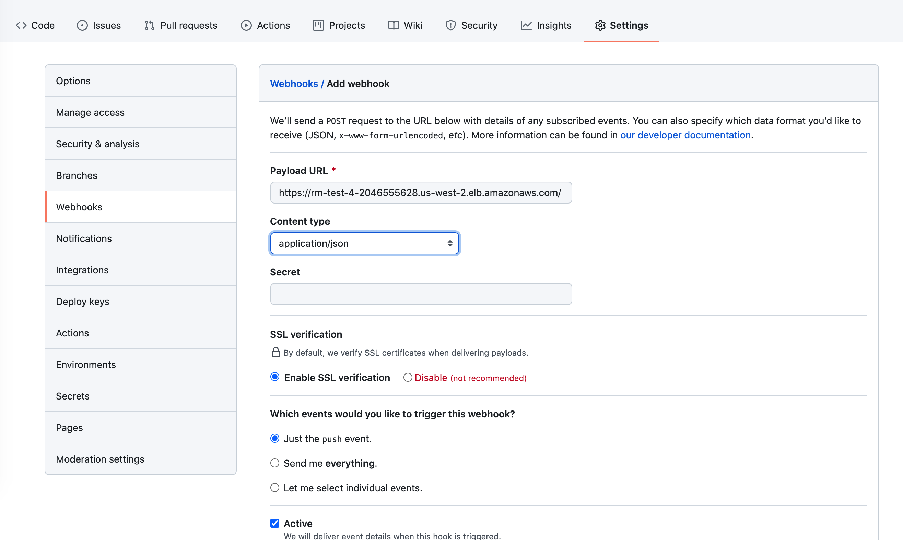
    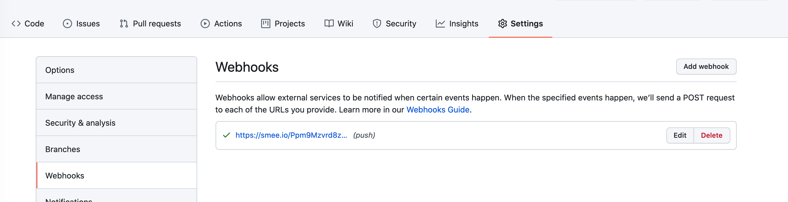
    Payload URL is the jenkins URL.
 3. Create the jenkins pipeline.
       - Select new item from jenkins dashboard 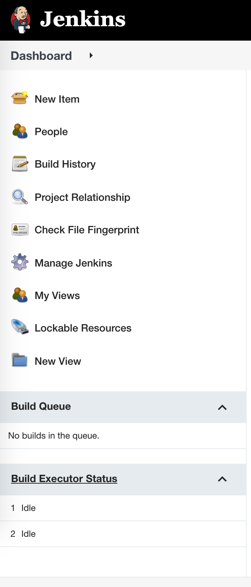
       - Select pipeline project with any name 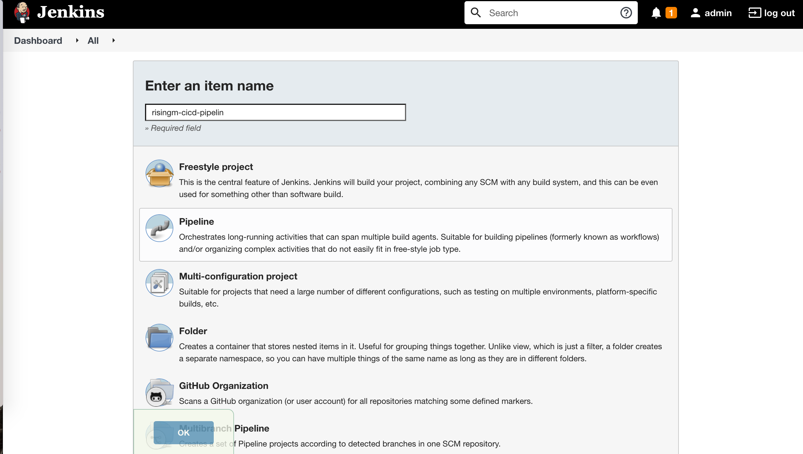
       - Select any log rotation duration according to your use & enter the github URl 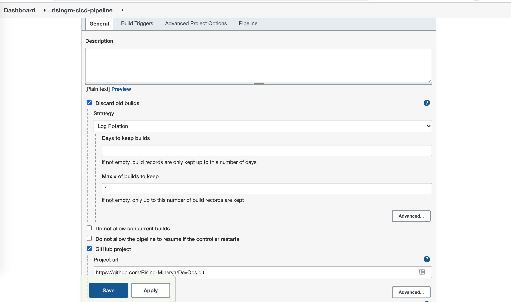
       - Select build trigger as Github hook. 
       - In Pipeline section 
            - definition - Pipeline script from SCM (Source code management)
            - SCM - Git
            - Repository URL - github URL
            - Credentials - if Repository is not public
            - Name - origin
            - Refspec - `+refs/heads/*:refs/remotes/origin/*`
            - Branches to build - Leave blank
            - Repository browser - Auto
             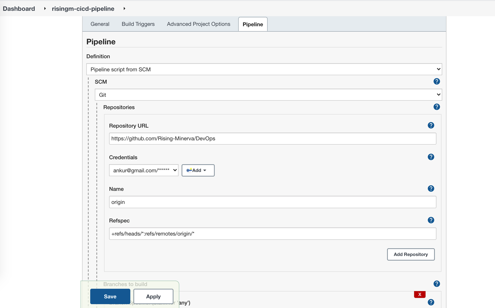
 4. In the script path - Labs/usecases/usecase-2/Jenkinsfile 
             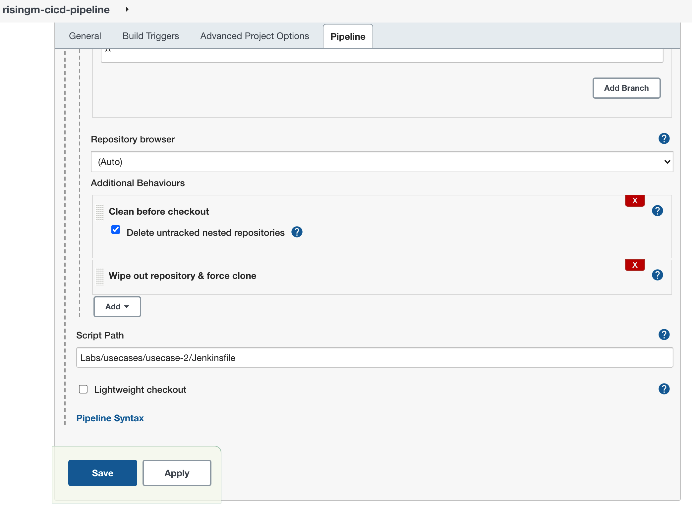
 5. For additional behaviour plugins must be installed like "Github, Wipe repository". Detailed information is present in jenkis configuration slide.
 5. Jenkins pipeline can be triggered from 'Build with parameters''.
               
 8. Pipeline logs can be seen by hovering each steps.
              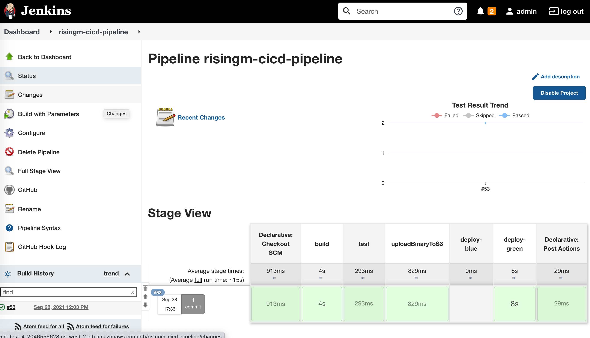
 9. One stage will be skipped [either deployment on green cluster or deployment on blue cluster]             
                
 9. Test result trends is also available for each build.
              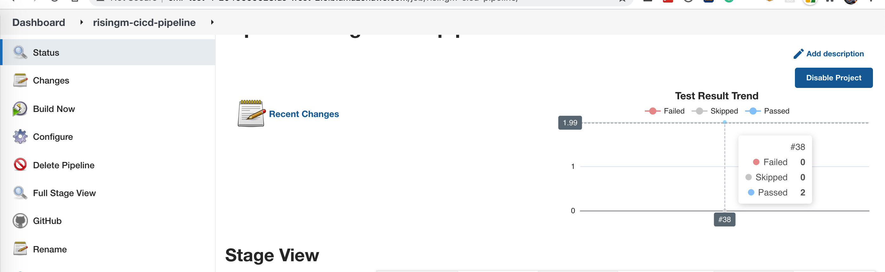              
           
 

---------------------------------------

Step 6. Notes/Additional instructions:
    
 1. Check if the binary is successfully updated on s3.
 2. Binary version can be changed from setup.py file - `version='1.0.0'`
 3. Login to AWS to check the resources created 
             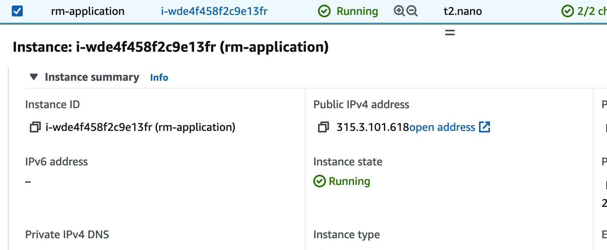.
 4. Check the security group created
 5. Application can be accessed by ec2 public ip.
             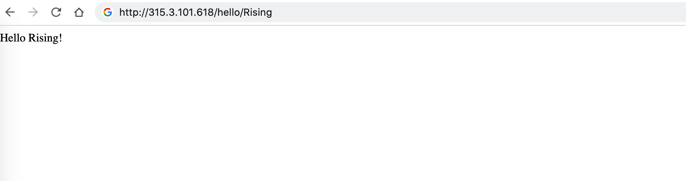.    
 6. final pipeline will look like this 
             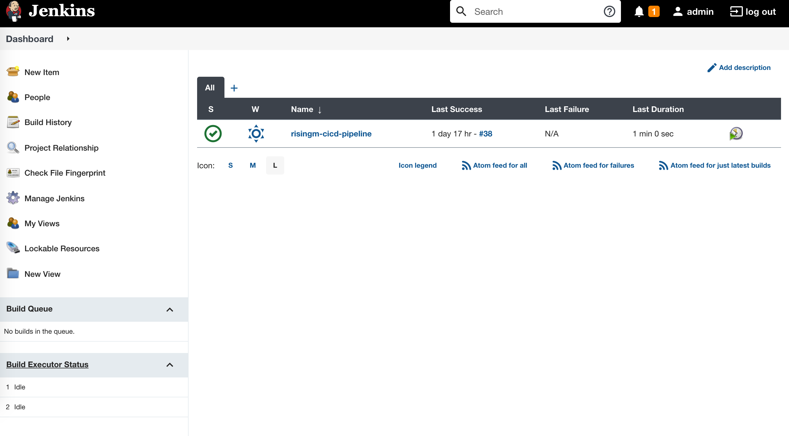. 
 7. We can destroy old cluster by terraform destroy command when new cluster is created
       - Destroy plan file is uploaded in s3 from jenkins steps 
       - Jenkinsfile - Line# 88, 89, 71, 72 
                
        aws s3 cp ${S3_BUCKET}/${S3_TERRAFORM_PATH}/green/<version>/planfile .
        terraform apply -auto-approve planfile      

