# DevOps
# WebHook
---------------------------------------
 1. Prerequisite
    - Create a github repo on which you want to create a webhook
    - Jenkins must be installed and configured
    - Jenkins UI is accessible.
    - Github repository admin permission.
    - Create any pipeline(scripted or declarative)
 
 2. Open github settings page (Needs repository admin permission)
        - Jenkins URL must be of format - http://<ip>:<port>/github-webhook/
        - Make sure to append "/github-webhook/" in the jenkins payload URL
        - URL will look like http://104.211.218.105:8080/github-webhook/
        - Replace the ip with the public ip of your jenkins server and the port on which your jenkins is running which is by default 8080.
        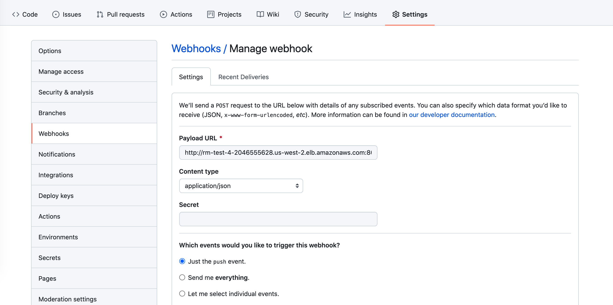
 3. Copy Jenkins URL and Paste in the Payload URL of Github webhook section.
       - Content type - application/json
       - SSL verification - Enable
       - Send me everything.
       - Active
       - Add Webhook
         
 4. Make sure that github webhook plugin is installed in jenkins
         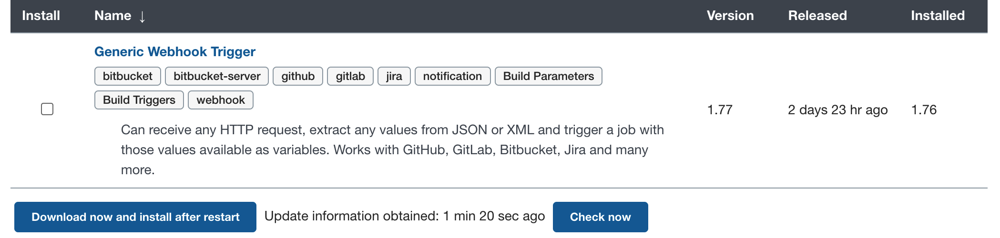
    
    - Installation steps if not installed already (Refer details on jenkins installation and configuration)
      - Click on Managed Jenkins
      - Click on Manage Plugins
      - Click on Available plugins tab
      - Search for "webhook"
      - Click on Generic Webhook Trigger Plugin and install``
      
 5. Create a jenkins pipeline
     Click on the new item from the jenkins Dashboard
        
 6.  Enter a name of pipeline and Create a jenkins freestyle project    
        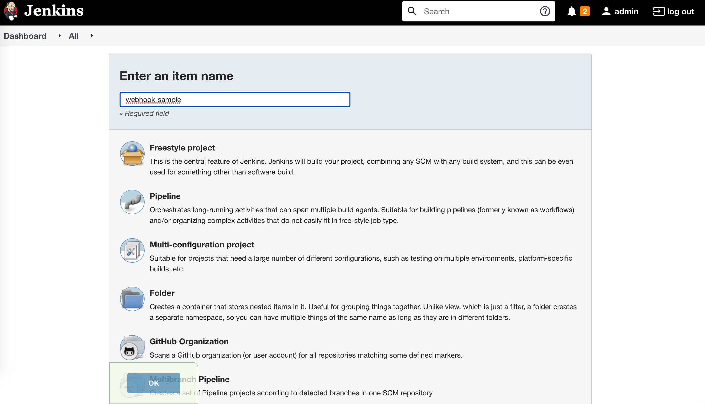  
 7. Select the Github project and enter the repository URL
        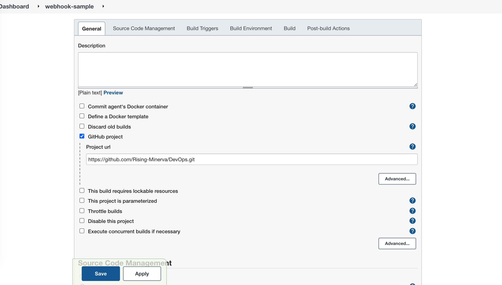
 8. Enter the github repository name in github SCM section of jenkins(Source code management).
        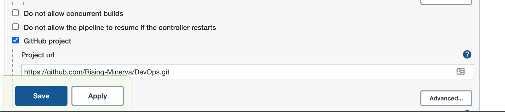
 9. Leave branch to build as empty and enter credentials if required.
        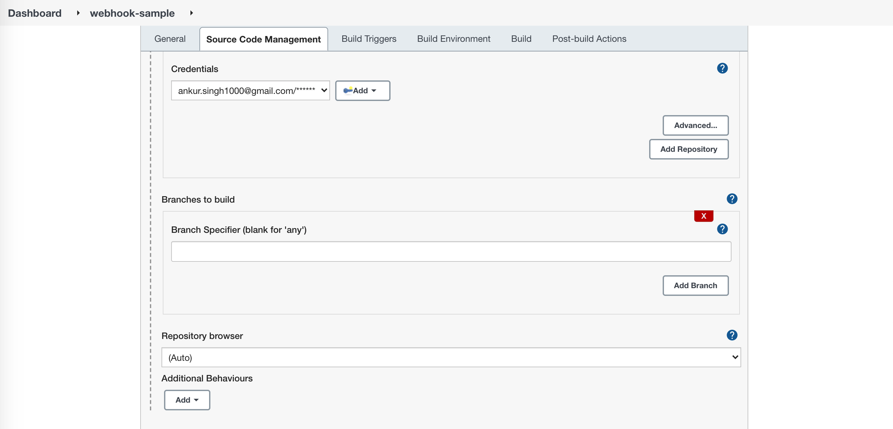 
 10. Enable the github web hook from build triggers
        - Do not choose the Trigger builds remotely option
        
 11. Select execute shell as build steps.      
        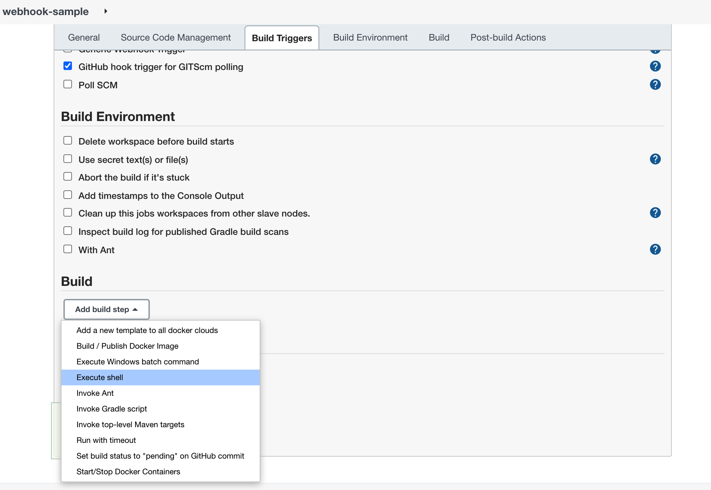 
 12. Enter any command in build steps
        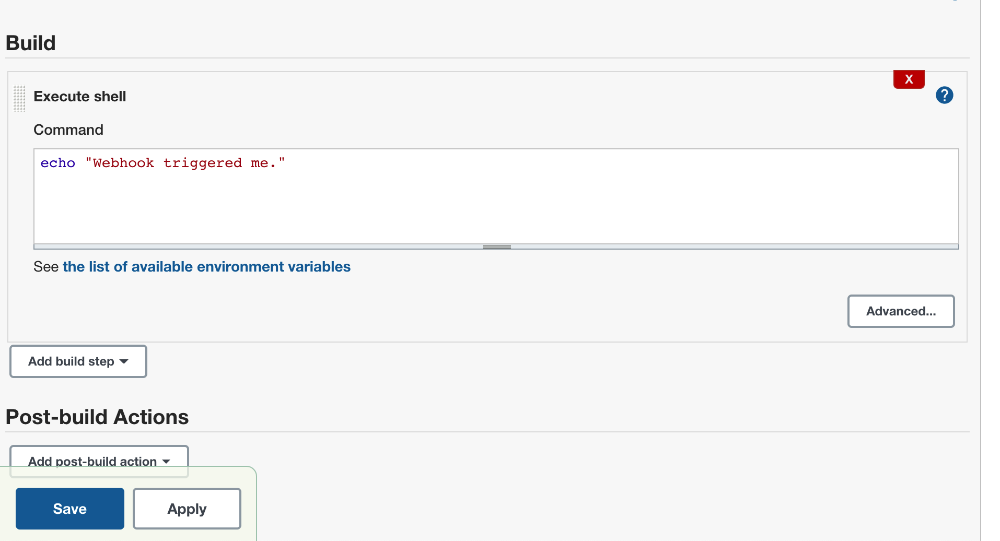
 13. Pipeline is ready, you can test the pipeline with a sample commit.       
         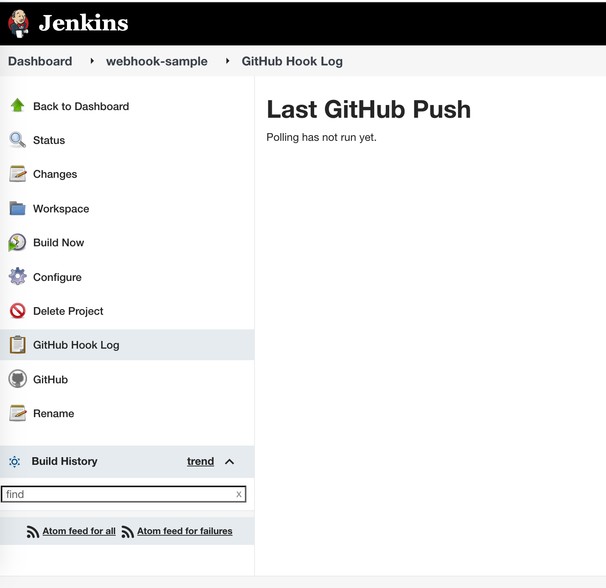
 14. Check logs of github payload delivery
         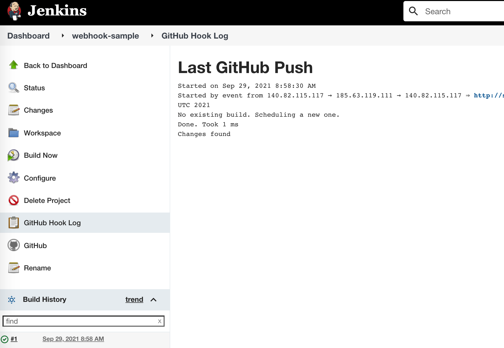
 15. Check the status and console output log.
         
         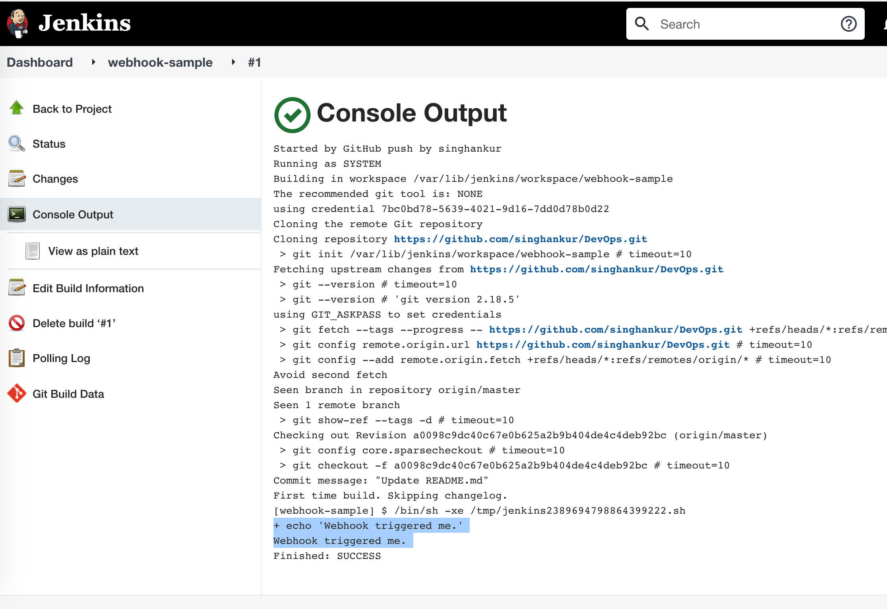      
          
---------------------------------------

Step 3. Common error 
 1. Github command not found:
    - Make sure github is installed on the box
    -  sudo yum install git -y
 2. No Valid Crumb
    - Make sure your Jenkins url is correctly set in the github
    - http://104.211.218.105:8080/github-webhook/
 3. Unable to deliver the payload Jenkins URL was incorrect in the webhook
    - Make sure port is attached in the jenkins payload url 
    - Default jenkins port is 8282, But we have made change it to 8080 refer jenkins installation and configurations.
 4. Git PullRequest job failed. Couldn't find any revision to build. Verify the repository and branch configuration for this job
    - Navigate to Git section.
    - Click "Advanced" to add 
      - Name: origin
      - Refspec: `+refs/heads/*:refs/remotes/origin/*`
      - Branches to build : leave blank
   

